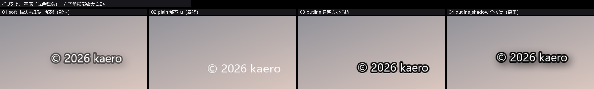
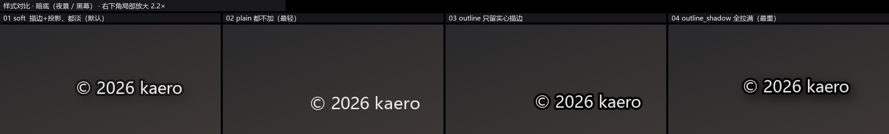
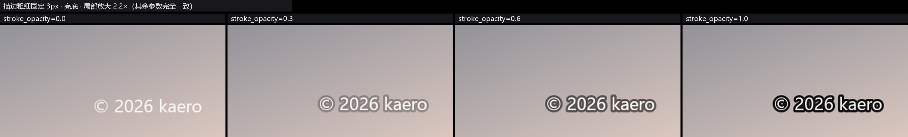
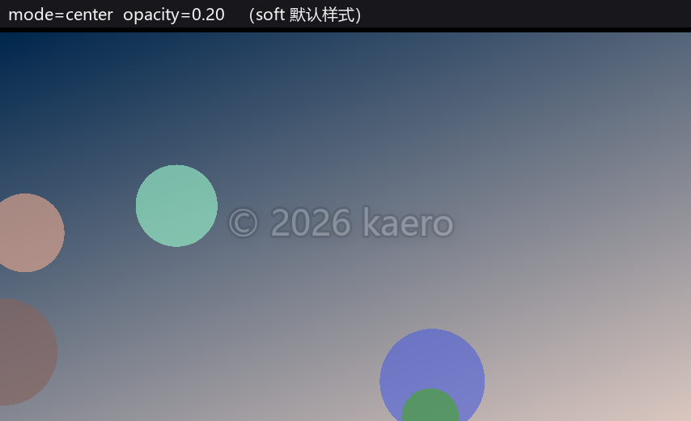
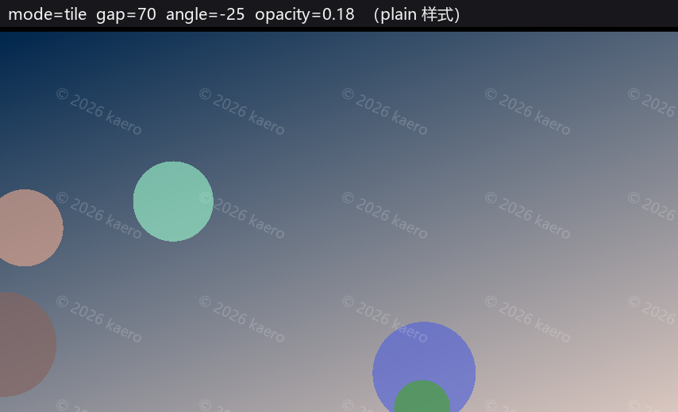
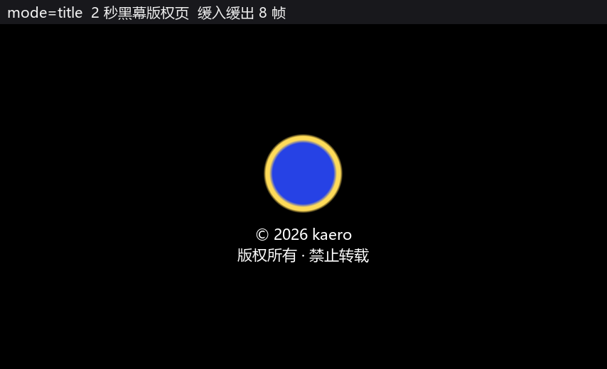
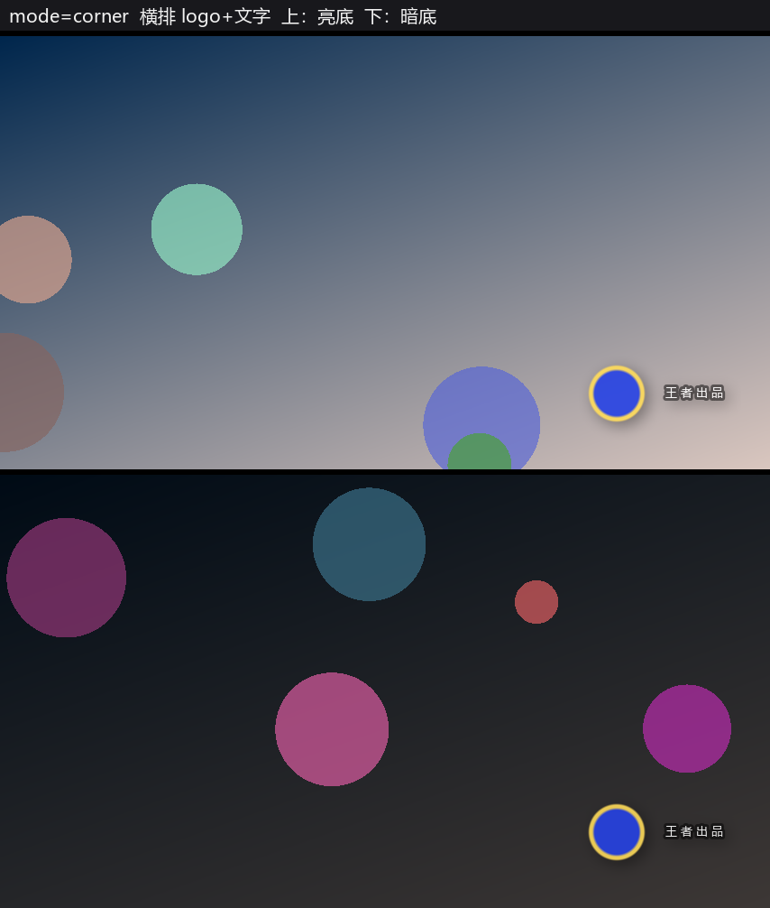

# comfyui-videomark（视频水印）

给视频打水印的 ComfyUI 自定义节点。**只认 IMAGE 批次，不绑定任何视频模型** ——
MiniMax H3、Wan、LTX、Hunyuan、VHS、AnimateDiff 这些出帧流程都能直接挂。
（只依赖 ComfyUI 自带的 torch / numpy / Pillow，不用装任何新依赖。）

水印内容支持自定义文字、带 alpha 通道的 PNG logo，或两者组合。
文字既可以在面板里手填，也可以**从上游节点接进来**（`text_in`）——
跑参数对比测试时把这一轮的参数烧进画面，回看时一眼就知道是哪一套。

**单张照片也直接用它** —— 一张图就是「长度为 1 的批次」，水印按这张图的宽高
实时排版，四角 / 居中 / 浮动 / 平铺都成立，横竖片自动适配。

批量处理一整包照片不在这里做：那是批处理工作流的强项，本包保持轻量，
只负责把水印本身做对 —— 三个节点里没有、也不会有「扫描文件夹」这类参数。

---

## 效果

**样式预设 —— 同一个镜头上的四种可见度**（右下角局部放大 2.2 倍）





**描边不透明度 0 / 0.3 / 0.6 / 1.0** —— 觉得描边太重，先降这个



**居中低透明** 与 **平铺**（最容易被忽略的两种方式）

 

**片头 / 片尾版权页** 与 **logo + 文字组合**

 

> 四角定位（四个角各一张）、浮动轨迹、完整时间轴、文字细节等更多样张，
> 见 [`preview/`](preview) 目录 —— 下面「自测工具 → 样张看什么」有逐张说明。

---

## 可视化面板

节点内置一套面板，不用记参数名：

```
+ 内容 ------------------------------+
|  (o) 只用文字 ( ) 文字+Logo ( ) 只用Logo |
|  [版权文字输入框]                    |
|  [上传 Logo] [清除]                  |
+ 水印样式 --------------------------+
|  [四角][居中][浮动][平铺]  <- 图形化选择 |
|  贴角  [左上][右上][左下][右下]       |
+ 微调 ------------------------------+
|  大小   -----o----   [  20 ] %      |
|  透明度 ----o-----   [0.85 ]        |
|  描边   ---o------   [0.55 ]        |
|  阴影   --o-------   [0.40 ]        |
|  边距   -----o----   [  32 ] px     |
+ 进阶参数（默认折叠）-----------------+
```

**几个设计取舍，用之前值得知道：**

- **面板不内置实时预览**。水印是「放上去就长期不变」的东西，看一次出片就知道了；
  为它维护一条「拖滑块 → 防抖 → 后端渲染 PNG → 回传」的链路不划算，拖起来还发涩。
  想看效果就跑一次，或开 `preview/` 里的样张对照。
- **描边 / 阴影滑块拉到底就是关掉它**（0 = 关闭），不另设开关 —— 少一个控件少一处歧义。
- **每个数值都有两个入口：滑块粗调 + 数字框精调**。用滑块凑出 0.85 很费劲，
  在右边那个框里敲两个字符就完了。滑块的 `min` / `max` / `step` 一概从后端
  `INPUT_TYPES` 取（`applyBounds()`），**前端一个数都不写** —— 自己抄一份的下场见「已知坑 19」。
- **样式预设的四个数值由后端 `/videomark/meta` 提供**，前端不抄一份 ——
  以后调预设，面板滑块自动跟上。
- **面板只是皮肤**：所有值仍写回原生 widget，节点参数一个没删。
  面板出问题最差也只是退回手动填参数，存好的工作流不会失效。
  老工作流里 `style` 还停在 `soft` 之类的预设档位时，面板会先把预设的四个数值铺到
  滑块上（**渲染结果完全不变**），再切成 `manual`，之后滑块才真正生效。

### 上传 logo

点「上传 Logo」选一张 PNG，自动落到 ComfyUI 的 `input` 目录并记进 `logo_file` 参数。
带 alpha 通道的 PNG 会完整保留透明区域。

也照旧可以把 `LoadImage` 的 IMAGE 接到 `logo` 输入口 —— **连线优先于上传的文件**，
所以需要动态 logo（比如跟着模型输出变）的流程不受影响。

### 界面语言

界面文案跟着 ComfyUI 的语言走，中英文都做了（含全部参数名称与提示）：

```
ComfyUI 设置 → Locale → 中文 / English
```

中文在 `locales/zh/nodeDefs.json`，英文在 `locales/en/nodeDefs.json`。
这两份是 **`tools/gen_locales.py` 从 `INPUT_TYPES()` 自动生成的**，
不存在「加了参数忘了加翻译」这种情况。改完节点参数记得重跑一次。

---

## 文字从外部接入（`text_in`）

三个节点都有一个 `text_in` 输入口，可以把文字从上游节点接进来。

**什么时候用**：拿来**做标注**，而不是版权声明。跑侧视图 / 参数对比测试时，
把这一轮的参数拼成文字烧进画面 —— 回看一堆图时一眼就知道哪张是哪套参数，
不用去翻文件名或者对着工作流猜。

**取值规则**：

| `text_in` 的状态 | 实际用哪段文字 |
|---|---|
| 接了线，且内容非空 | **连线的文字**（面板里手填的自动让位） |
| 接了线，但上游给的是空串 / 只有空白 | 面板手填的文字 |
| 没接线 | 面板手填的文字 |

「连线优先」和这个包 logo 的规则是同一套（连线 > `logo_file`）：显式接进来的东西
是你当下要用的，控件里那份只是上一次留下的记录。空串按「没接」处理，
是因为上游节点经常输出空字符串（条件没命中、文本被清空），
这时回落到手填文字，比把水印整个变没要合理。

**接法**：上游任何有 STRING 输出的节点都行 ——

```
String Function 🐍 / Text Concatenate ──text──┐
                                              ├─► text_in   VideoMark Overlay
分辨率、seed、LoRA 强度… ──────────────────────┘
```

节点**不会替你填任何值**：要显示什么，就在上游拼好什么。`text_in` 只吃一段字符串。

**注意点**：

- 面板上那个文字框**不会被清空**（拔线后还要接着用）：接线后它会被淡掉，
  下面挂一条「已接外部文字」的提示。因为 `text_in` 不是控件，光看界面看不出来
  "值到底从哪来"，所以必须明说；
- `use_text`（显示文字开关）关掉时，外部文字一样不画；
- `VideoMark Video` 的片头片尾卡片：`title_text` 留空时会跟着 `text` 走，
  所以外部接进来的文字也会自动用到卡片上，不用再接一根线；
- 它是 **`forceInput` 的连线口，不是控件**，所以**不占工作流的控件坑位** ——
  加这个参数对已有工作流零影响（老工作流照常加载，控件值一位都不会错）。

---

## 四种水印方式

| 方式 | `mode` | 说明 | 建议 `opacity` |
|---|---|---|---|
| **四角固定** | `corner` | 贴在四个角之一，按 `margin` 留安全边距。最不挡画面，日常首选 | 0.75 ~ 1.0 |
| **居中低透明** | `center` | 画面正中。透明度必须压低，否则很影响观赏 | 0.12 ~ 0.22 |
| **浮动** | `floating` | 在安全区内匀速游走或周期跳位。防盗最强，观感最差 | 0.25 ~ 0.45 |
| **平铺**（附加） | `tile` | 全画面倾斜平铺。最难裁掉 / 抹除，适合强防盗场合 | 0.10 ~ 0.20 |

另有独立节点 **VideoMark Title** 负责第 4 类需求：片头 / 片尾插入 ~2 秒黑幕版权页（文字 + logo）。

---

## 样式：描边 / 投影 / 透明度

水印"太显眼"和"看不清"是同一件事的两端。这里给了三个旋钮，外加一个一键预设。

### `style` 预设（一键换整套参数）

| 预设 | 描边 | 投影 | 描边不透明度 | 投影不透明度 | 什么时候用 |
|---|---|---|---|---|---|
| **`soft`**（默认） | ✅ | ✅ | 0.55 | 0.40 | 明暗镜头混剪，想"看得清但不抢画面" |
| `plain` | ❌ | ❌ | — | — | 画面本来就干净，水印越轻越好 |
| `outline` | ✅ | ❌ | 1.00 | — | 镜头明暗反差极剧烈，只有硬描边压得住 |
| `outline_shadow` | ✅ | ✅ | 1.00 | 0.60 | 最强，几乎任何背景都看得清（也最显眼） |
| `manual` | 自定义 | 自定义 | 自定义 | 自定义 | 四个控件全由你定 |

> **选预设时，下面四个控件会被预设覆盖**；要逐项手调就把 `style` 切到 `manual`。
> 这样"一键换风格"和"手动微调"不会互相打架。

### 三个旋钮

| 参数 | 默认 | 说明 |
|---|---|---|
| `use_stroke` / `stroke_width` / `stroke_color` | 开 / 3 / `#000000` | 沿文字外圈描一圈边。`stroke_width` 只在描边打开时生效 |
| `stroke_opacity` | **0.55** | **觉得描边太重就先降这个**。1.0 = 实心黑边，0.5~0.6 = 柔和一圈，0 = 等于关掉 |
| `use_shadow` / `shadow_color` | 开 / `#000000` | 把轮廓往外晕开一点。比描边柔和得多，不糊硬边 |
| `shadow_opacity` | **0.40** | 投影自身不透明度，0.3~0.5 是"看得见轮廓但不抢眼"的甜区 |
| `shadow_offset` | 5 | 偏移（像素，右下为正）。4~8 像自然投影；**0 = 四周对称的柔和光晕**，观感更轻，贴角时也不占边距 |
| `shadow_blur` | 8 | 模糊半径。越大越柔；0 = 硬边（等于把字复制一份） |
| `opacity` | 0.85 | **整个水印**的不透明度，参考值见上一节表格 |

### 怎么选（按"可见度由轻到重"）

```
plain  →  soft  →  outline  →  outline_shadow
最不干扰            默认起点              最强防盗
```

先看默认 `soft`。觉得还是重 → 把 `stroke_opacity` 降到 0.3，或 `style` 换 `plain`；
画面里有大段纯白 / 纯黑 → `outline`；要在任何画面都保证看得清 → `outline_shadow`。

> ⚠️ **深色投影在夜景 / 黑幕上是隐形的**（黑影子落在黑底上）。纯暗调片子别只靠投影，
> 要么留着描边，要么把 `shadow_color` 改成 `#FFFFFF` 之类亮色。

---

## 节点

### 1. `VideoMark Overlay（画面水印）`
`IMAGE` 进 → `IMAGE` 出。给逐帧画面打水印，**单张照片也用它**：
一张图就是长度为 1 的批次，`scale` 按这张图的宽度等比算，横竖片都自动适配。

| 参数 | 默认 | 说明 |
|---|---|---|
| `mode` | `corner` | 四种方式见上表 |
| `position` | `bottom_right` | corner 模式下贴哪个角 |
| `text` | `© 2026 kaero` | 支持多行 |
| `opacity` | `0.85` | 不透明度，参考值见上表 |
| `scale` | `20` | **水印宽度占画面宽度的百分比**，换分辨率不用改 |
| `margin` | `32` | 距边缘的安全边距（**像素**）。浮动 / 平铺同样受它约束 |
| `use_text` / `use_logo` | 开 / 关 | 接上 logo 后把 `use_logo` 打开才会画 |
| `layout` | `vertical` | logo 与文字同时存在时的排布 |
| `color` | `#FFFFFF` | 文字颜色 |
| `style` | `soft` | **样式预设**：`soft` / `plain` / `outline` / `outline_shadow` / `manual`，见上一节 |
| `use_stroke` / `stroke_width` / `stroke_color` | 开 / 3 / `#000000` | 描边。`manual` 下才读这里的值 |
| `stroke_opacity` | `0.55` | **描边自身透明度 —— 觉得描边太重先降它**（`manual` 下才生效） |
| `use_shadow` / `shadow_color` | 开 / `#000000` | 投影开关与颜色（`manual` 下才生效） |
| `shadow_opacity` / `shadow_offset` / `shadow_blur` | `0.40` / 5 / 8 | 投影强度、偏移、模糊（`manual` 下才生效） |
| `angle` | 0 | 整体旋转。平铺配 -20~-30 度最难抹 |
| `font` / `font_file` | 微软雅黑 / 空 | 下拉选字体；`font_file` 填绝对路径可覆盖 |
| `float_path` | `diagonal` | 浮动轨迹：`diagonal` / `horizontal` / `vertical` / `circle` / `random` |
| `float_cycles` | 1.0 | 浮动模式走完的来回圈数；`random` 下表示位置切换次数 |
| `seed` | 0 | 仅 `random` 轨迹用 |
| `start_pct` / `end_pct` | 0 / 1 | 水印出现的区间（占总长比例） |
| `fade_frames` | 0 | 出现 / 消失的淡入淡出帧数 |
| `tile_gap` | 90 | 平铺间距（像素） |

可选连线：`text_in`（STRING，外部文字）、`logo`（IMAGE）、`logo_mask`（MASK）。

写照片时下面前三项是**不起作用**的，不必去调：

| 参数 | 单张照片上的表现 |
|---|---|
| `start_pct` / `end_pct` | 无效果。单张图整张算第 0 帧，默认值 0 / 1 本来就覆盖它，所以**不会**把水印藏掉 |
| `fade_frames` | 无效果。没有前后帧可淡 |
| `float_cycles` | 无效果。没有「走」的过程，位置由 `seed` 定死成一个点，每次跑都一样 |

### 2. `VideoMark Title（片头片尾版权页）`
`IMAGE` (+ 可选 `AUDIO`) 进 → `IMAGE` + `AUDIO` 出。

| 参数 | 默认 | 说明 |
|---|---|---|
| `fps` | 24 | **必须和最终合成视频的帧率一致**，否则时长不对 |
| `where` | `head` | `head` / `tail` / `both` |
| `seconds` | 2.0 | 卡片时长 |
| `text` | `© 2026 kaero\n版权所有 · 禁止转载` | 卡片文字 |
| `use_text` / `use_logo` | 开 / 关 | 关掉可只留 logo |
| `bg_color` | `#000000` | 卡片底色 |
| `logo_scale` / `text_scale` | 30 / 24 | 各占画面宽度的百分比 |
| `text_color` / `text_stroke_*` | `#FFFFFF` / 0 / `#000000` | 文字样式 |
| `layout` | `vertical` | logo 与文字的排布 |
| `fade_frames` | 8 | 淡入淡出帧数，0 = 硬切 |
| `pad_audio` | 开 | **给音频补等长静音**，保证加了片头后音画不错位 |

可选连线：`text_in`（STRING，外部文字）、`logo`、`logo_mask`、`audio`。

> `pad_audio` 一定要开着。片头加了 2 秒黑幕而音频没跟着推后 2 秒，整条音轨就会提前 2 秒，
> 后面全部对不上。

### 3. `VideoMark Video（视频一站式）`
`VIDEO` 进 → `VIDEO` 出，画面水印 + 片头片尾一次做完，音频自动处理。
帧率从输入视频里读，不用手填。

想精细控制时，改用 Overlay + Title 串两个节点，参数更全。

外部文字同样是 `text_in` 一个口；片头片尾卡片的 `title_text` 留空时跟着 `text` 走，
所以接进来的文字会同时用到画面水印和卡片上，不用再接两根线。

### 4. 单张照片：不另开节点，直接用 Overlay
```
加载图像 → VideoMark Overlay → 保存图像
```

就这三步。照片不需要 `VideoMark Title` —— 「片头片尾」是视频时间轴上的概念；
也不需要别的节点，因为水印排版本来就是「按图宽等比」算的，单张图正好是它的输入。

**为什么不内置「扫描文件夹、逐张处理、写盘」**：那是批处理工作流的强项
（ComfyUI 里能用 `Load Image Batch` 一类节点串出来，还能顺带做重命名、格式转换、
上传图库）。本包只解决水印一件事 —— 参数少、行为可预测，不用为它长期维护
文件遍历、后缀命名、写盘冲突这些跟水印无关的逻辑。

> 真要在 ComfyUI 里批量，正确姿势是「批处理工作流 + 每张各自的尺寸」，
> 而不是让水印节点去认文件夹：`IMAGE` 是**同尺寸批次张量**，
> 1200×800 和 800×1200 塞不进同一个批次，强行拼出来的是错的。

---

## 典型接法

### A. IMAGE 批次流程（H3 / Wan / LTX…）
```
… 视频模型 → 解码出 IMAGE 批次 ─┬─→ VideoMark Overlay ─→ VideoMark Title ─→ 合成视频
                                                          ↑
                                                    音频 ──┘（可省）
```
VideoMark Title 的 `audio` 输出接回合成节点，加了片头音画也不会错位。

### B. 拿到的是 VIDEO 对象
两种办法：
- **一步**：`VIDEO → VideoMark Video → 保存视频`；
- **组合**：`VIDEO → 获取视频元素 → VideoMark Overlay → VideoMark Title → 创建视频 → 保存视频`。

### C. 只做片尾版权页
`where = tail`、`seconds = 2`、`pad_audio` 开。

### D. 给单张照片加水印
```
加载图像 → VideoMark Overlay → 保存图像
```
`scale` 是「水印宽度占画面宽度的百分比」，所以在 480p 上调好的参数，拿到 4K 照片上照样合适。
右下角有平台水印位时把 `position` 改成 `top_left`。

---

## 已知坑

1. **字体缺字形**：`黑体（simhei）` 没有 `©` 字形，用它会渲染成方框。含 `©` 的文字建议用
   **微软雅黑 / 宋体 / 楷体**。自己的手写体、商用字体走 `font_file` 填绝对路径。
2. **`fps` 必须对齐**：Title 节点靠 `秒数 × fps` 算帧数，填错会让卡片时长不对。
3. **`margin` 是像素**：736×992 用 24~40，1080p 用 36~64。换分辨率时记得看一眼。
4. **`scale` 是百分比**：这个是相对量，换分辨率不用改。
5. **logo 的透明度优先级**：`logo_mask` > PNG 自带 alpha 通道 > 完全不透明。
   ComfyUI 的「加载图像」会把 PNG 透明通道单独输出成 `MASK`，接过来最稳。
6. **logo 自带的透明边会被裁掉**，所以一个四周留白的 logo 实际宽度会略小于 `scale`，这是对的。
7. **片头卡片的帧不参与水印**：卡片本身是干净的版权页，不叠水印。
8. **渲染失败不会中断流程**：任何异常都会退化成「原样透传」并在控制台打一行 `[VideoMark]` 日志。
9. **深色投影在夜景 / 黑幕上隐形**：黑影子落在黑底上等于没有。纯暗调片子请留描边，
   或把 `shadow_color` 改成亮色。
10. **描边会占用宽度预算**：`scale` 是「图章宽度 = 画面宽 X%」，描边的宽度算在这个 X% 里，
    所以描边越粗、文字本体越小。想让字更大就减小 `stroke_width` 或加大 `scale`。
11. **样式预设会覆盖四个样式控件**：想做精细调整，把 `style` 切到 `manual`。
    （用可视化面板的话不用管这条 —— 面板会自动接管这层关系。）
12. **面板的改动要重启 ComfyUI 才会生效**：`web/` 是启动时扫描的，新加的前端文件
    不重启不加载。只是改了 `web/videomark.js` 的话 `Ctrl+Shift+R` 刷前端即可，
    但如果原来就没有 `web/` 目录，必须重启。
13. **面板接口没挂上时面板照常能用**，只是老工作流里停在预设档（`soft` 之类）的参数
    不会被铺到滑块上（滑块保持原值，得自己调）。控制台会打一行
    `[VideoMark] 未注册面板接口`。
14. **面板是按节点类型拼出来的，不是每种节点都有全部控件**：正片节点没有「片头」分组、
    片头节点没有样式卡片。所以内部一律用 `$$("[data-g]")` 扫「面板上真实存在的分组」
    再各自取值，**不要写成一串 `$('[data-g="x"]')` 逐个取** —— 取不到就是 `null`，
    一句 `null.querySelectorAll` 直接抛 `TypeError`。这个坑真实发生过：异常抛在上传
    logo 的 `try` 里，界面报「上传失败」，其实文件早就传上去了，人会一直以为是自己
    的文件有问题。`uicheck.py` 现在会静态检查「模板分组 ↔ GROUP_VALUE 取值表」是否对齐。
15. **别把 UI 刷新和业务结果包在同一个 `try` 里**：上传成功后的刷新走 `refreshUI()`
    （内部 `try/catch` 只记控制台），否则界面层的任何异常都会冒充业务失败。
16. **新参数只能往控件表末尾加，绝对不能插在中间**。ComfyUI 的工作流按「位置」存控件值
    （`widgets_values` 是个数组，不是字典），中间插一个 = 它后面所有控件的值整体右移一位，
    加载时报一串看起来毫不相干的错。真实案例（`logo_file` 当初被插在 `font_file` 与
    `float_path` 之间）：

    ```
    float_path   输入值 1 不可用                    ← 其实是老的 float_cycles
    float_cycles 输入值 2261135997 高于最大值 200    ← 其实是老的 seed
    seed         输入值 randomize 无法转换为 INT      ← 其实是老的 control_after_generate
    ```

    前端确实有按名字恢复的一套（`widgets_values_named` + 设置项
    `Comfy.Workflow.NamedValuesRestore`），但那个设置**默认关闭**，老工作流里也没有
    这个字段 —— 默认路径就是纯位置恢复，所以只能从「顺序」上解决。

    现在的规矩是：`logo_file` 由 `_with_logo()` 钉在每个节点控件表最后一位，
    顺带在面板里加了一次性迁移（`migrateLegacyWidgets()`）把「已经按错位排列存下来」
    的工作流就地还原。`uicheck.py` 会静态检查这条规则有没有被破坏。
17. **DOM widget 的外边距会把面板底部吃掉一截**（只在关掉「节点 2.0 / Vue Nodes」、
    走画布渲染时出现）。前端 `_arrangeWidgets()` 里 `computedHeight = computeSize()[1] + 4`，
    而画布叠加层按 `computedHeight - margin*2` 摆放，`BaseDOMWidgetImpl.DEFAULT_MARGIN` 是
    **10** —— 可视高度比内容少 16px。面板根节点是 `height:100%` + `overflow:hidden`，
    少多少就切多少。现在显式传 `margin: 0`，并让 `measure()` 把读到的 margin 补回去
    （两条腿一起站，免得某个版本忽略 `margin: 0` 时又切）。
18. **新参数光在 `INPUT_TYPES` 里声明还不够，`apply()` 的形参表必须收得下**。
    ComfyUI 执行节点走的是 `f(**inputs)`，`inputs` 的键**完全来自** `INPUT_TYPES`
    的 required + optional —— 声明里多一个、签名里少一个，跑到那一步就挂：

    ```
    TypeError: VideoMarkOverlay.apply() got an unexpected keyword argument 'logo_file'
    ```

    报错位置在 `execution.py` 里，看着像框架的锅，其实是节点自己的。加 `logo_file`
    那次就踩了：三个节点里只有 Title 的签名顺手改了。现在 `promptcheck.py` 会静态
    比对「声明的键 ⊆ 签名形参」，`callcheck.py` 再按前端攒 prompt 的方式真跑一次。
19. **滑块的边界必须从后端 `INPUT_TYPES` 取，别在前端抄一份**。抄过的代价两头都出过：

    | 参数 | 模板里写死的 | 后端其实是 | 后果 |
    |---|---|---|---|
    | `margin` | `0 ~ 200` | `0 ~ 600` | 面板悄悄替用户砍掉了合法值，人只会以为「最多 200」 |
    | `opacity` | `0 ~ 1` | `0.02 ~ 1` | 面板放进来的那段后端直接拒，拖到底再跑就报「低于最小值」 |
    | `float_cycles` | `0.5 ~ 20` | `0.1 ~ 200` | 上下都被砍 |
    | `start_pct` / `end_pct` | step `0.01` | step `0.001` | 滑块比允许的粗十倍 |

    两种坏法都不报错、肉眼看不出来。所以现在面板里**一个边界数字都没有**，全由
    `applyBounds()` 从 `widget.options` 灌进来；`uicheck.py` 会拦「`sl()` 模板里又出现
    `min`/`max`/`step`」和「手写 `<input type="range">` 绕过 `sl()`」两种写法。

    顺带记一笔 —— 0.34.1 里这三个字段**不是一回事**：

    | 字段 | 实际含义 |
    |---|---|
    | `options.step` | 声明的 step **× 10** —— 拖拽灵敏度，别拿它当步长 |
    | `options.step2` | 声明的 step，真步长（箭头键一格走这么多） |
    | `options.round` | `10^-precision`，FLOAT 落值时按它四舍五入 |

    面板要跟原生控件落在同一张网格上，所以步长取 `step2`、吸附取 `round`
    （`stepOf()` / `gridOf()` 两个纯函数，`jscheck.py` 直接测它们）。

20. **数字框有三条不能破的规矩**（`bindSlider()` 上有完整注释）：

    1. 敲的当下就生效，但**敲到一半和越界一律不写**（`"-"`、`"1."`、空、超范围都返回
       `null`）—— 节点上永远不留后端会拒的值；
    2. **吸附只发生在收口**（失焦 / 回车 / `change`）。边敲边吸附会把用户正在输入的
       字改掉：敲 `0.375` 到第三位就被改成 `0.38`，后面没法接着敲；
    3. **正在这个框里打字时，任何刷新都不许覆盖它** —— 刷新可能是上传 logo、切样式、
       折叠分组触发的，覆盖等于把敲了一半的数字吃掉。

    `jscheck.py` 里 26 条断言守的就是这三条。其中「空框不是 0」那条是写完立刻跑出来的
    真 bug：`Number("") === 0`，不挡的话**清空输入框会把参数写成 0**。

21. **`forceInput` 的输入是连线口、不是控件 —— 加它不占控件坑位**（这是坑 16 的唯一例外）。
    三个节点的 `text_in`（外部文字）就是这么加的：

    ```python
    "text_in": ("STRING", {"forceInput": True})     # 只长成一个连线口，不生成控件
    ```

    依据在前端 `settingStore` 里：`let o = n.widgets.get(i.type); if (!o || t.forceInput) return;`
    —— 命中直接返回，不建控件。**没有控件 = 不占 `widgets_values` 的槽位**，
    所以这类参数可以随便加，对老工作流一位都不影响（本机 3 个工作流实测：真错位 0）。

    两条容易写错的：

    - **必须放 `optional`**。放 `required` 就变成「必填连线口」—— 没接线的工作流
      直接报缺输入，一个「想接才接」的功能升级即坏。`uicheck.py` 的
      `check_link_inputs()` 静态守着这条；
    - **别手滑去掉 `forceInput`**。去掉它立刻变成一个多出来的控件槽，把之后所有控件值
      顶错位一位（就是坑 16）。这个后果很隐蔽，但 `selftest.py` 的**控件槽位冻结表**
      和 `uicheck.py` 都会立刻报出来。

    顺带一个连带坑：**检查脚本自己也得认这条规则**。`uicheck.py` 的 `is_widget_param()`
    原来不看 `forceInput`，加完 `text_in` 就误报「控件型参数面板没有接管：text_in」——
    而照着它去补，就会让面板引用一个根本不存在的控件，错的方向刚好相反。

---

## 自测工具

改完代码跑这一条就够（会按顺序跑完下面除 `guardcheck.py` 外的全部检查）：

```bat
python tools\check_all.py
```

单项也可以单独跑：

```bat
python tools\selftest.py      :: 渲染核心 + 节点逻辑，22 项（含「单张照片」「外部文字接入」「控件槽位冻结表」），并产出 preview/ 样张
python tools\uicheck.py       :: 面板与后端参数是否一一对应（漏参 / 名字写错 / 文案缺翻译 / 分组对齐 / 控件顺序 / forceInput 连线口是否误放 required）
python tools\jscheck.py       :: 前端脚本语法 + 坑位迁移 + 数字框精度/吸附 + 连线状态判定的行为测试（需要 node，没有就跳过）
python tools\gen_locales.py   :: 由 INPUT_TYPES 生成 locales/zh 与 locales/en
python tools\loadcheck.py     :: 按 ComfyUI 方式加载，查注册、重名与面板接口
python tools\promptcheck.py   :: 用 ComfyUI 后端校验器验输入声明 + 参数契约（声明的键 apply() 收得下）
python tools\callcheck.py     :: 按前端攒 prompt 的方式真调一次 apply()，并验 logo 的四种来源 / 降级 + 外部文字的接管与回落
python tools\guardcheck.py    :: 变异测试 —— 故意改坏代码，验上面三道防线**会不会响**（会改写 nodes.py 后立即还原，所以不放进 check_all 的默认步骤）
```

**`uicheck.py` 是这套面板的保险栓**：节点的原生 widget 已经被面板接管并隐藏了，
所以一旦「后端加了参数、面板忘了给它位置」，那个参数在界面上就彻底消失了。
这个脚本把 `web/videomark.js` 的 SPECS 和 `INPUT_TYPES()` 对一遍，静态就能查出来。
它同时守着另外几件肉眼难查的事：i18n 中英键是否对称、**面板分组（`data-g`）与取值表
（`GROUP_VALUE`）是否对齐**（对不上就是已知坑 14 那个 `TypeError`）、
**`logo_file` 有没有被挪出末尾**（已知坑 16 那个整体错位）、
**`forceInput` 的连线口有没有被误放进 `required`**（已知坑 21）、
以及**滑块有没有绕开 `sl()` 生成**（绕开就同时丢掉数字框和后端边界，见已知坑 19）。

`selftest.py` 里有一张**控件槽位冻结表**（`FROZEN_WIDGETS`）：把三个节点的控件顺序
逐位钉死（Overlay 32 / Title 18 / Video 36 格，含 `seed` 后面那格
`control_after_generate`）。ComfyUI 按位置存控件值，所以这份顺序就是老工作流的兼容契约 ——
谁往中间插一个参数，这张表立刻报出来。**改这张表之前先想清楚是不是在把所有老工作流弄坏。**

这套防线本身也要被验证 —— `tools/guardcheck.py` 做三次变异测试
（去掉 `forceInput` / 把连线口放进 `required` / 往控件表中间插参数），
要求三道检查**必须**响，并在结束后逐字节校验 `nodes.py` 没被写坏。
「绿的自检只说明现有代码没问题，不说明检查有效」，这条经验就是这么来的。

> 它**真的会改写 `nodes.py`**（改完从内存还原并校验 sha256），所以单独跑，
> 不塞进 `check_all.py` 的默认步骤 —— 它验的是「防线本身有没有效」，
> 不是每次改代码都需要跑的东西。

`promptcheck.py` / `callcheck.py` 是上一条坑的双保险：前者**静态**比对
「`INPUT_TYPES` 声明的键 ⊆ `apply()` 的形参名」，后者**动态**——把声明的键全量当
关键字参数灌进 `apply()`，等价于前端攒出来的那个 `inputs`，顺带验四件 logo 的事
（`logo_file` 真的生效 / 文件不存在时降级成纯文字 / 连线优先于文件 / 开关关掉时不干扰），
以及四件外部文字的事（三个节点都有 `text_in` 且是 `forceInput` / 空串与纯手填逐像素一致 /
连线后画面确实变了 / 外部文字与手填同一段字**逐像素一致** —— 证明走的是同一条渲染路径，
不是另开一条早晚会跑偏的分支）。

> 这两个是补上来的：`promptcheck.py` 原来只调 `execution.validate_prompt()`，
> 那是**纯声明校验** —— 它只看 `INPUT_TYPES` 长什么样，从不碰 `apply()` 的签名；
> `selftest.py` 里调 `apply()` 又全是手写参数。于是「声明了但签名没接」这种错，
> 六关全绿也照样漏到用户手上。

`jscheck.py` 管另外一半：`uicheck.py` 只看名字对不对，看不出 JS 本身能不能跑。
它把前端那两行 `import` 桩掉、导出函数，直接在 node 里跑 —— 一是 `--check` 查语法
（这个文件里出过一次 Python 式字符串隐式拼接的语法错，整块面板直接不加载），
二是把「老排列 / 新排列 / 错位排列」三种存档铺到控件上，验证迁移逻辑认人不认错，
    三是 26 条数字框断言（显示精度 / 边敲边写 / 收口夹范围与吸附 / 步长与网格怎么取）。

### 样张看什么

`preview/` 下所有样张都值得打开看一眼，断言测不出「看不看得见」：

| 样张 | 看什么 |
|---|---|
| [`01_corner.png`](preview/01_corner.png) | 四角定位（soft 默认样式） |
| [`02_center_lowopacity.png`](preview/02_center_lowopacity.png) / [`04_tile.png`](preview/04_tile.png) | 居中低透明 / 平铺 |
| [`03_floating_*.png`](preview) | 五条浮动轨迹（diagonal / horizontal / vertical / circle / random） |
| [`05_logo_combo.png`](preview/05_logo_combo.png) / [`06_title_card.png`](preview/06_title_card.png) | logo + 文字组合 / 片头版权页 |
| [`07_timeline.png`](preview/07_timeline.png) | 片头卡片 → 正片 → 片尾卡片 的完整时间轴 |
| [`08_text_detail.png`](preview/08_text_detail.png) | 文字与 logo 的渲染细节 |
| [`09_style_compare.png`](preview/09_style_compare.png) / [`09b_..._dark.png`](preview/09b_style_compare_dark.png) | 四种样式在亮底 / 暗底上的对比 |
| [`10_stroke_opacity.png`](preview/10_stroke_opacity.png) / [`10b_..._dark.png`](preview/10b_stroke_opacity_dark.png) | 描边透明度 0 / 0.3 / 0.6 / 1.0 的梯度 |

样式相关的样张是**局部放大 2.2 倍**的：整帧缩到一行里，描边和投影的差别根本看不出来。

---

## 目录

```
comfyui-videomark/
├── __init__.py        节点注册入口 + 挂载前端目录与面板接口
├── nodes.py           三个节点的定义（INPUT_TYPES 是唯一数据源）
├── render.py          渲染核心（纯 numpy + Pillow，可离线测）
├── fonts.py           字体发现与解析
├── logofile.py        从 input 目录安全读取上传的 logo
├── webapi.py          面板接口 /videomark/meta（喂样式预设表）
├── web/
│   └── videomark.js   可视化面板（DOM widget，含中英文）
├── locales/
│   ├── zh/nodeDefs.json   中文界面文案（自动生成）
│   └── en/nodeDefs.json   英文界面文案（自动生成）
├── pyproject.toml
├── preview/           自测产出的样张
└── tools/
    ├── check_all.py   一键跑完下面所有检查
    ├── selftest.py    渲染核心 + 节点逻辑（含「单张照片」）
    ├── uicheck.py     面板与后端参数一致性 + 控件顺序
    ├── jscheck.py     前端脚本语法 + 坑位迁移行为（需要 node）
    ├── gen_locales.py 生成语言包
    ├── loadcheck.py   加载自检（含面板接口）
    ├── promptcheck.py 后端校验
    ├── callcheck.py   按前端方式真调一次 apply()
    └── guardcheck.py  变异测试：验防线本身会不会响
```

---

## 安装

```bash
cd ComfyUI/custom_nodes
git clone <本仓库地址>
```

或者直接把 `comfyui-videomark/` 整个目录丢进 `ComfyUI/custom_nodes/`。

**不需要安装任何依赖** —— 只用 ComfyUI 自带的 torch / numpy / Pillow。装完重启 ComfyUI。

> 面板的改动要重启才生效（`web/` 是启动时扫描的）；只改了 `web/videomark.js` 的话
> `Ctrl+Shift+R` 刷一下前端就行。

---

## 许可

[MIT](LICENSE) —— 随便用、随便改、随便分发，留着版权声明就行。
